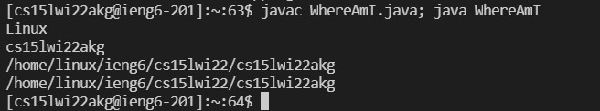

## Welcome to Lab 1

### [Home](https://ank010.github.io/cse15l-lab-reports/index.html)

### Setting up Server Access
This lab is a step-by-step tutorial on how to log into a course-specific account on ieng6.

### Step 1: Installing VScode
In order to access the online server, ieng6, we need to go through a terminal. VScode, an IDE, will provide that terminal. If not already downloaded, got to [https://code.visualstudio.com/](https://code.visualstudio.com/) and follow their instructions in donwloading it onto your computer. 

Once it is downloaded, open it up and it should look something like this:

### Step 2: Remotely Connecting
Now we will log in to the remote server through the terminal in VScode. First, you have to find the course-specific username through this link: [Course Specific ID](https://sdacs.ucsd.edu/~icc/index.php). Remember to reset the password for the account if you haven't done so already.

Next, open up the terminal in VScode (View --> Terminal) and enter in your course-specific ID as shown below, with the ssh:

You will get a message asking if you want to connect, enter 'y' to continue. After entering your password, you  will see something like this in your terminal:

Once you get here, you have successfully logged in to the remote server!

## Using Some Commands
Now that we are in the server, we can try some commands that are commonly used when navigating around. 
Here is a list of commands:
- cd ~
- cd
- ls -lat
- ls -a
- ls <directory> where <directory> is /home/linux/ieng6/[username]
- cp /home/linux/ieng6/cs15lwi22/public/hello.txt ~/

This is what it looks like running some of them:

## Copying Files From Local to the Server
Now that we will work on moving files from local computer to the online server using the 'scp' command. 
First log out of the ieng6 by simply typing in exit to the command line
Now, create a file on your computer, give a default constructor + any print statements
Next, open the terminal (make sure the directory is correct) and enter the following:

You will have to enter your password again, but once you do, login to ieng6, use the command ls and the file should show up in the list. Now you can run it on the ieng6 server as well. 

### Setting an SSH Key
Entering your password, especially when it is a complicated one, everytime you log in to ieng6, make changes to a file or upload a new file is very time consuming. Making an SSH key can rapidly speed up that process. 

Here's how you can generate a public - private key pair to speed it up:

It will prompt you to to enter a passphrase twice before rendering a ssh key art and saving the file. 

For Windows users, need to follow extra steps, found [here](https://docs.microsoft.com/en-us/windows-server/administration/openssh/openssh_keymanagement#user-key-generation) to finish the process. Otherwise you have to enter the passphrase everytime you log in.

Now we have 2 files - the id_rsa and the id_rsa.pub which is the public key. Just add the public key file onto the ieng6 server and you can then bypass the password steps when logging in or making changes:

## Optimizing Remote Running
Now while we have already sped up the process of copying files, however there are a few things we can do to optimize the process. 
First thing is: using the up arrow to recall prior command lines
The terminal stores all of your command line arguments until you trash it, so hitting the up arrow once or twice and recalling a command can save you a lot of time, especially if you have to type 'cs15lwi22akg@ieng6.ucsd.edu' everytime. 

Secondly, and more importantly, we can add multiple commands to one line so we don't have to wait in between typing one command after another:

or more advanced:

and you can compile and run in one line:

These tricks will allow for running programs faster with fewer keystrokes and less hastle. To show this, let's see how many keystrokes it takes me to upload and rerun the file 'Where Am I' after making changes to it. Since I've already typed in the commands to upload and login to the remote server, it takes 4 keystrokes (up arrow plus an enter) to run the scp, another 4 to run the ssh, and finally another 4 to run javac and java. With a total of 12 keystrokes, I've uploaded the edited file, relogged in to the remote server, compiled and ran the file. If I were to type in each command line every time, even assuming I combined scp, ssh, javac and java commands into one line, it would be well over 12 keystrokes. Furthermore, if I have the scp and ssh commands in a seperate document and I haven't entered them in my terminal yet, I can simply do ctrl + c, ctrl + v for each (total of 10 keystrokes with enters) then do the same for javac and java as one command line which is an additional 5 keystrokes. By doing this, we reduce the number of keystrokes even more since it takes only 15 to run the scp, ssh, javac and java the first time, then an additional 12 every time we make a change and reupload after that. By using the tips above, we need to enter each command only once into the terminal and simply use the arrow keys to reaccess it every time afterwards. This not only saves time, but reduces the chance of typos and having to retype lines unneccessarily.  
