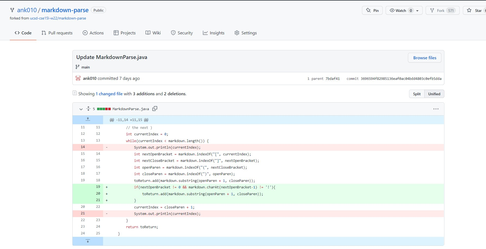
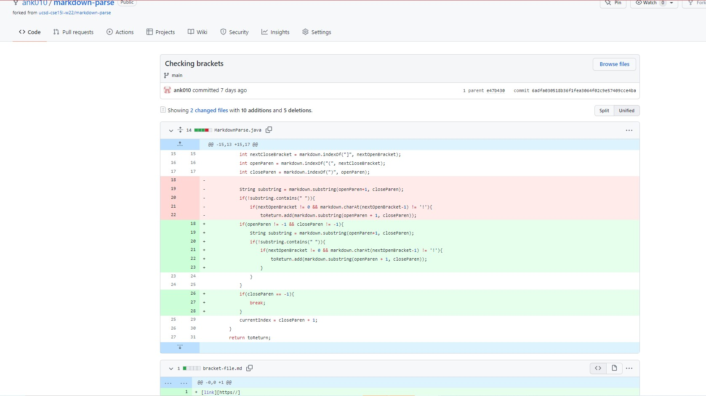

## Welcome to Lab 1

### [Home](https://ank010.github.io/cse15l-lab-reports/index.html)

### Bug #1
The code changes:


Link to the file that caused the error: [Test-file2A](https://ank010.github.io/cse15l-lab-reports/test-file2A.html)

The symptom of the bug:
```
[randomimage.png]
```
While initially, MarkdownParse runs properly by identifying where the link is supposed to be in the line in the .md file, but it doesn't take into account that there are multiple different objects/things that can be coded in this way. Namely, pictures, as is the case in this scenario. The bug is that there is no place in the code where it differentiates what type of thing is being linked in the line MarkdownParse is reading. This causes the syptom where a "link" is printed out in the console despite the link in question not actually being a link to a website but rather the name of an image. The failure-inducing input is a line in an md file that works to display an image from the folder onto the page instead of a link. 

We corrected this error, as seen in the screenshot, by checking that there is no ! before the first [ on the line which eliminates the chance that the program prints out the image name thinking it is a link. 

### Bug #2
The code changes:


Link to the file that caused the error: [Empty-file](https://ank010.github.io/cse15l-lab-reports/empty-file.html)

Symptom of the bug:
```
[this is random text]
```

As it was before, MarkdownParse correctly identified what is in the part of the line where a link should be. However, if we type something else between the  ( ) like we have done in empty-file, it can't differentiate between a link and a sentence or random words. That is the bug, the syptom is that we can get things other than links being printed out, even though we are now checking for images, as long as the line looks like:
```
[...](...)
```
The failure inducing input is a line in an md file that works to display a link but instead of putting a link between the ( ), there is literally any characters or words in there with spaces. 

We corrected this by checking, prior to the check for an image, if there is a space in the "link". If there is, then we know the text is something else - links don't have spaces. 

### Bug #3
The code changes:


Link to the file that caused the error: [Bracket-file](https://ank010.github.io/cse15l-lab-reports/bracket-file.html)

Symptom of the bug:
```
Exception in thread "main" java.lang.StringIndexOutOfBoundsException: begin 0, end -1, length 15
```

In order to correctly identify which text to print out, the program looks for the first ( and ) after the ] on a certain line, based on the proper syntax for putting a link in the markdown file. However, we never consider if there is, for whatever reason, a [] but no set of () after it anywhere in the file. This is the bug that causes the open and close parenthesis variables to -1 since they aren't there, which in turn causes the error above since we can't go from index 0 to index -1 in a file because the starting index is 0. The failure inducing input is a markdown file with a set of [ ] but no set of ( ) following it. 

We fixed the problem by checking, before any of our other new checks, if there is a set of ( ) after the set of [ ] in the file, otherwise everything else we are trying to do, we are unable to since there is no ( ) if our check returns false. 

That is the end of lab report 2!