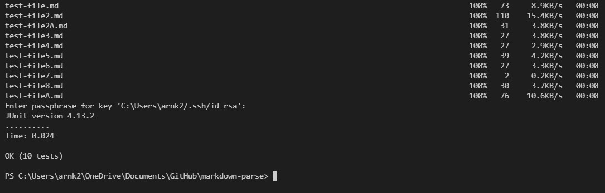

## Welcome to Lab 3

### [Home](https://ank010.github.io/cse15l-lab-reports/index.html)

### Copy whole directories with scp -r

The command scp -r copies the whole root directory rather than just a single file as scp does. 

Here we will be copying the whole of markdown-parse onto ieng6:


There will be a long output of all the hidden files and public files it copies over to the remote server. 

Now when we ```ssh``` into ieng6 and use the ``` ls``` command:


We see that we have the folder now on our remote server we can run the files in that folder on ieng6. 


As seen above. Make sure to ```cd``` into the markdown-parse folder before running tests. 

These are the compile and run commands for future reference:
```
javac -cp .:lib/junit-4.13.2.jar:lib/hamcrest-core-1.3.jar MarkdownParseTest.java

java -cp .:lib/junit-4.13.2.jar:lib/hamcrest-core-1.3.jar org.junit.runner.JUnitCore MarkdownParseTest
```

Now, we can make this process faster by combining the lines to copy the files over to ieng6 and ssh into the remote server in one step then running the files in one line once we are in:


Then after the files are copied and we are entered into ieng6, the test will run:



And all of them passed successfully. I had to use a workaround command to ensure that compiling and running MarkdownParseTest.java worked properly when using a one line command. They are modified versions of the command lines written above. 

```
/software/CSE/oracle-java-se-14/jdk-14.0.2/bin/javac -cp .:lib/junit-4.13.2.jar:lib/hamcrest-core-1.3.jar MarkdownParseTest.java

/software/CSE/oracle-java-se-14/jdk-14.0.2/bin/java -cp .:lib/junit-4.13.2.jar:lib/hamcrest-core-1.3.jar org.junit.runner.JUnitCore MarkdownParseTest

```

Through combining the command lines, we can copy to a remote server, enter the server, and run the files all in just a few keystrokes. 

### This is the end of lab report #3!

