## Welcome to Lab 4

### [Home](https://ank010.github.io/cse15l-lab-reports/index.html)

[Link to Personal MarkdownParse](https://github.com/ank010/markdown-parse)

[Link to Reviewed MarkdownParse](https://github.com/maotcha/markdown-parse)

We are tasked with running 3 tests on our personal markdown-parse and the one we reviewed in week 7. The text of the test files can be found at the link here:
[Test Cases - Lab 4](https://ucsd-cse15l-w22.github.io/week/week8/)

### Test Case 1:
Looking at test case 1, our expected outcome should be :
```
[`google.com", "google.com", "ucsd.edu]
```

When running on our personal markdown parse, we get:
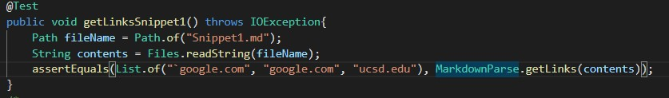

and the outcome:
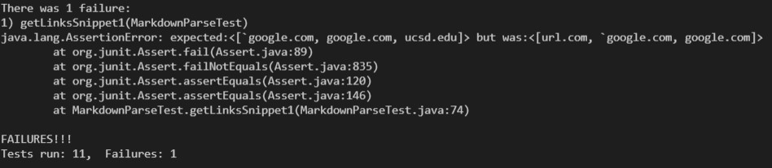

Which is a failure because the program finds the first line as link when it's not and doesn't find the last line as a link when it is one. 

When running on the reviewed code, we get:
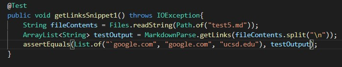

and the outcome:
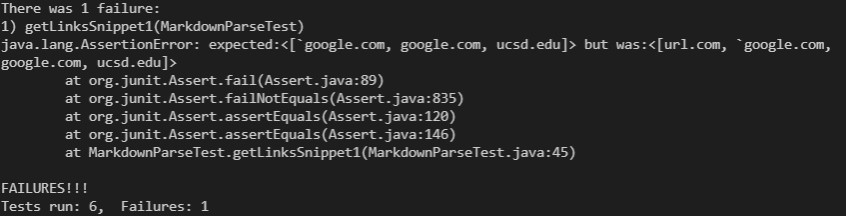

Which is a failure because the program finds the first line as a link when it's not. One key difference between this one and my personal is that this one found the last line as a link while mine did not. 

For my code, I think that the idea behind fixing it is relatively simple, but would take quite a few lines, mainly for fixing the bug brought up by the first line in the md file because we have to check if any of the command characters like ` or ~ are closed before the [. For the second bug, I think a similar solution to the reviewed code where they work from the end on in matching the square brackets should help fix it. 

### Test Case 2:
Looking at test case 2, our expected outcome should be: 
```
[a.com, a.com(()), example.com]
```

When running on my personal markdown parse, I get:
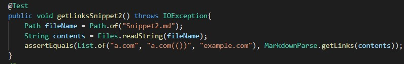

and the outcome:
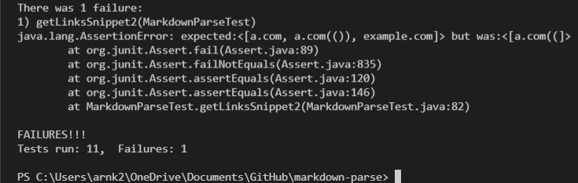

Which is a failure because it didn't catch the link in either the first or third line and only got a part of the link in line 2. 

When running on the reviewed code, we get:
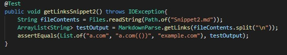

and the output:
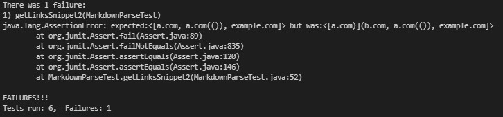

Which is also a failure because in the first link we have an extra ) and in the second link, it put both b.com and a.com. A key difference between my personal and the reviewed code is the reviewed code was able to pinpoint the links in lines 1 and 3 and get all of the link in line 2 even if there were additional characters in some places. 

For my code, I think that looking at the reviewed code and implementing some of their ideas first could really help make it more reliable, but I think the main fix, similar to the fix for Test 1, is looking at the outer brackets or () and working inwards. I think that implementing some of the algorithm used in the reviewed code will help but I don't think it will take more than 10 lines to fix the bug. Have to focus on changing how we search for and pair the open and close brackets in a line. So it's mainly rewritting lines rather than writing more lines. 

### Test Case 3:
Looking at test case 3, our expected output should be: 
```
[https://www.twitter.com, https://ucsd-cse15l-w22.github.io/, https://cse.ucsd.edu/]
```

When running on my personal markdown parse, I get: 
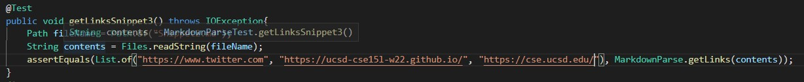

and the output:
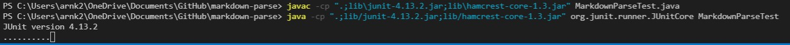

Which gets stuck in an infinite loop as seen above. 

When running on the reviewed code, we get:
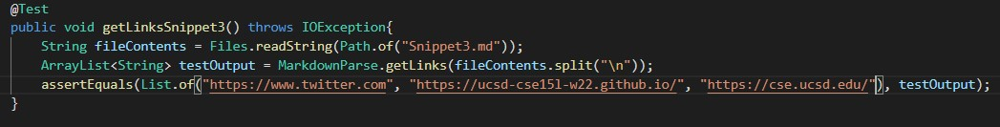

and the output:
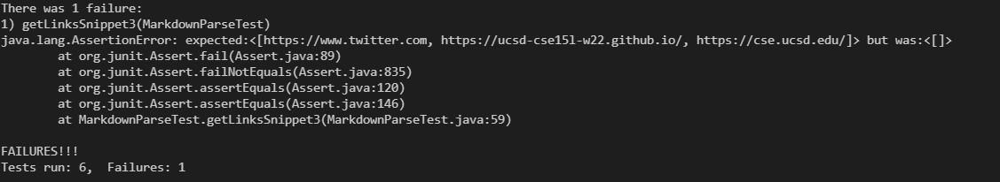

Which is a failure but does not result in an infinite loop but rather returns an empty list of links when we are supposed to have 3 links in the list. 

For my code, I think that the main fix is looking for the ending bracket or parenthesis on other lines if they are not on the same line as the open bracket or parenthesis. The main probem is deciding when to stop the search and how to detect new/different links that could show up on other lines. I think this will take around 10+ lines, there's quite a few possibilities to check. 

